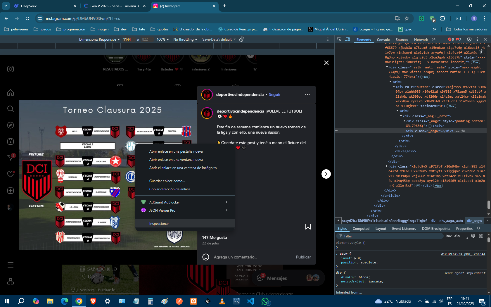
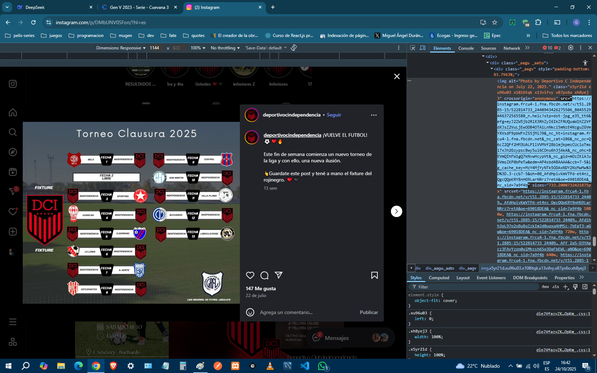
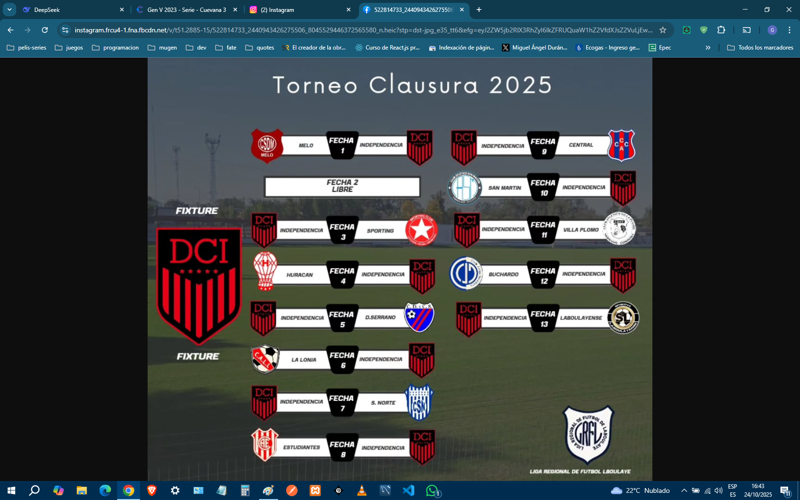

# Tutorial sobre como descargar imágenes de instagram

Si bien de instagram **"no se puede"** descargar imágenes, les doy un tip: abran las herramientas de desarrollo del navegador, inspeccionen la imagen que quieren bajar, busquen en el __HTML__ de la página la etiqueta __img__, copien el link del __src__ y lo pegan en la barra de navegación. Cuando lo corran al link, les debería aparecer la imagen

1. Abren devtool, click derecho sobre la imagen asi les resulta mas fácil encontrar la etiqueta img
  

    
  

2. Una vez que encuentran la etiqueta img, buscan el src dentro la misma y copian el enlace
  

    
  

3. Pegan en enlace en la barra de direcciones del navegador, y esa imagen la pueden descargar
   

    
  
